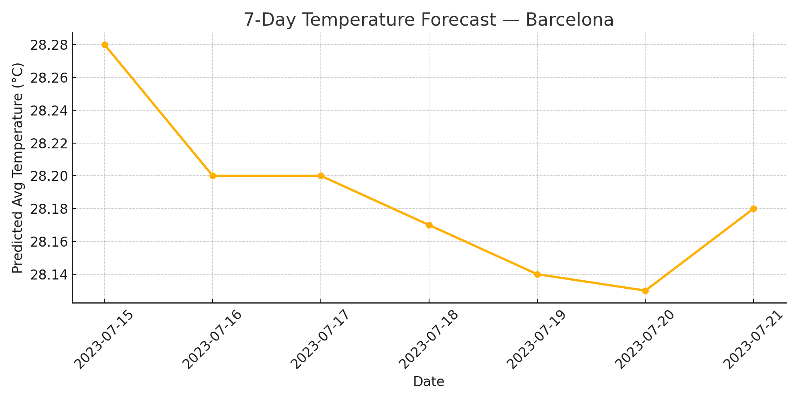
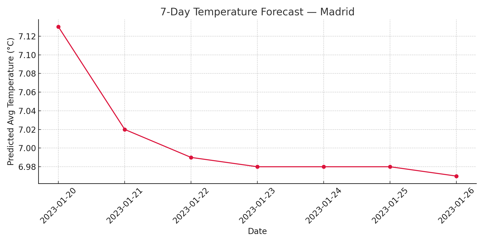
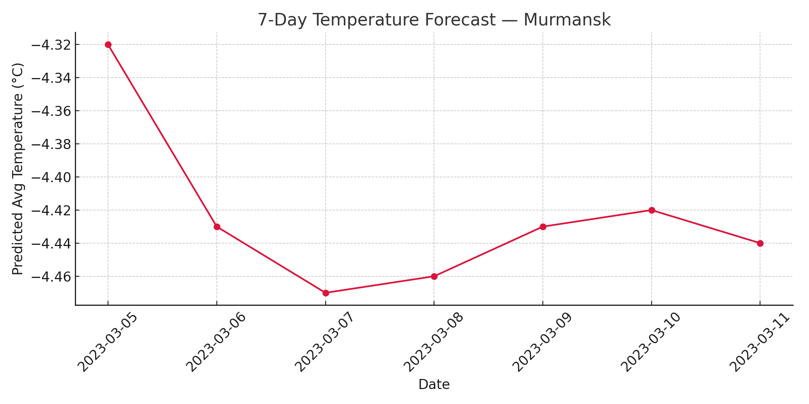
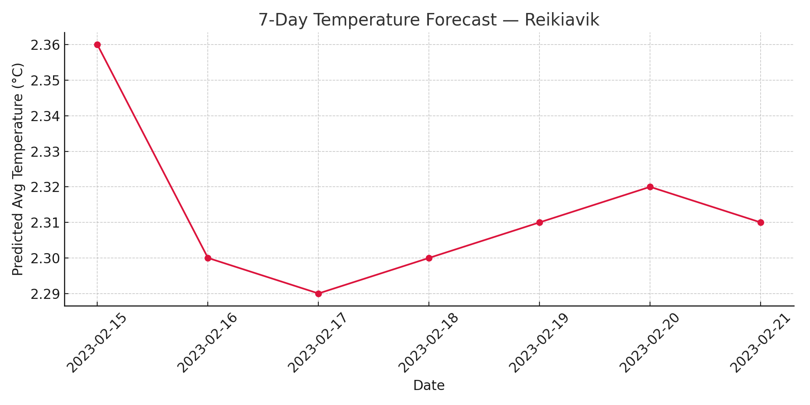

# 🌦️ transformer-weather-prediction

Time series temperature forecasting using a Transformer-based Seq2Seq model with ARIMA residual adjustment.

## 🧠 Model Summary

This project implements a hybrid forecasting pipeline for daily average temperatures across 21 European cities.  
The core model is a Transformer-based Sequence-to-Sequence (Seq2Seq) architecture trained on sliding windows of historical meteorological data.  
To enhance long-term accuracy, final predictions are corrected using an ARIMA model fitted on the residuals.

## ⚙️ Architecture

- **Encoder-Decoder Transformer** with positional encoding and autoregressive decoding  
- Input sequence: 45-day historical window + seasonal lags (weekly and yearly)  
- Output sequence: 7-day forward temperature forecast  
- **Residual correction**: ARIMA(1,0,1)(1,1,1)[7] fitted on the last year of training residuals

## 🛠️ Technologies Used

- Python · PyTorch · scikit-learn · statsmodels  
- Custom DataLoader, Early Stopping, Learning Rate Scheduling  
- Evaluation metrics: MAE, RMSE, and R²

## 📊 Results (Test Set)

- **MAE**: 2.36 °C  
- **RMSE**: 3.02 °C  
- **R²**: 0.88

## 🖼️ Forecast Samples

Below are sample 7-day forecasts generated by the deployed model via FastAPI:

<p align="center">
  
  
  
  
</p>

These forecasts demonstrate how the model adapts to diverse climatic profiles across Europe.

## 📁 Repository Contents

- `transformer_weather_forecasting.py`: Full pipeline for preprocessing, training, evaluation, and ARIMA correction  
- `weather_api.py`: FastAPI-based endpoint for real-time temperature prediction  
- `modelo_final.pth`: Trained model weights (see link below)  
- `datos_combinados.csv`: Preprocessed input dataset  
- `resultados_mejorado.png`: Final prediction vs actual scatter plot  
- `figures/`: Folder with forecast result visualizations

## 📦 Download Trained Model

🔗 You can download the trained model weights here:  
👉 [modelo_final.pth (Google Drive)](https://drive.google.com/file/d/1ziS0eqpvQCVH8lnDZmApKUwZIavyKQaa/view?usp=sharing)

> This file is hosted externally to comply with GitHub storage guidelines.

## ⚙️ Installation

Clone the repository and install the required dependencies:

```bash
git clone https://github.com/Suesta/transformer-weather-prediction.git
cd transformer-weather-prediction
pip install -r requirements.txt
````

## 🚀 Usage

### Option A — Train from scratch

```bash
python transformer_weather_forecasting.py
```

This will preprocess the data, train the Transformer model with ARIMA correction, and save:

* The trained weights (`modelo_final.pth`)
* The performance plots (`resultados_mejorado.png`)

### Option B — Use pretrained model

Download the pretrained weights from the link above and load them:

```python
import torch
from transformer_weather_forecasting import TransformerSeq2Seq, Config

model = TransformerSeq2Seq(input_size=32, cfg=Config())
model.load_state_dict(torch.load("modelo_final.pth", map_location="cpu"))
model.eval()
```

## 🌐 API Deployment

Run the FastAPI service for real-time predictions:

```bash
uvicorn weather_api:app --reload
```

Once running, the API will be available at:
👉 `http://127.0.0.1:8000/docs` (Swagger UI with interactive documentation)

## 📖 Citation

If you use this repository in your research or projects, please cite:

```
Suesta, Víctor. (2025). Transformer Weather Prediction with ARIMA Residual Correction.
```

---

## 🔗 Author
Víctor Suesta  
[LinkedIn](https://www.linkedin.com/in/víctor-suesta-arribas-7b1250322/)

© Víctor Suesta — 2025

```

---

¿Quieres que te prepare también el archivo `requirements.txt` exacto (con versiones estables de PyTorch, scikit-learn, statsmodels, etc.) para que tu repo quede totalmente reproducible?
```
